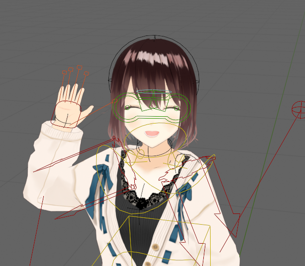
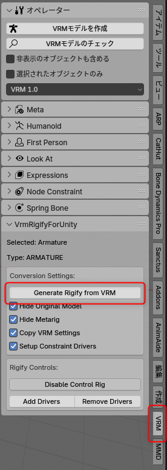
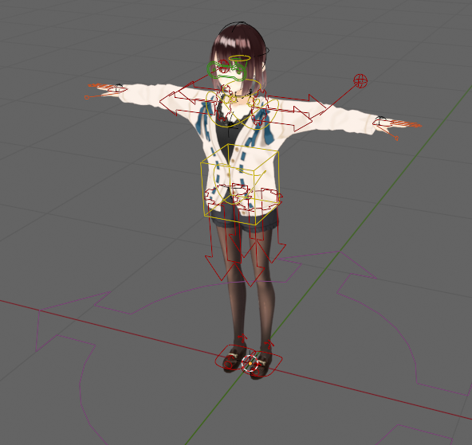
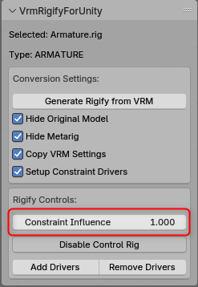

# VrmRigifyForUnity

BlenderのVRMモデルからRigifyリグを自動生成し、Unity向けに調整するアドオン

## 概要

VrmRigifyForUnityは、VRMフォーマットの3Dモデルを読み込み、Blenderの強力なRigifyシステムを使用してリグを自動生成するBlenderアドオンです。生成されたリグはUnityでの使用に調整されており、VRMの情報も保持されます。

このアドオンにより、VRMモデルのアニメーション作業がRigifyの高機能なリグコントロールで可能になり、Unityへのエクスポート互換性も確保されます。

## 特徴

- VRMモデルからRigifyリグを自動生成
- VRMの表情制御機能を維持
- Unityでの使用に最適化された階層構造とボーン配置
- DEFボーンのコンストレイントを一括制御するドライバーシステム
- 元のVRM拡張情報を新しいリグに転送
- カスタムボーン（髪、衣服など）の自動接続

## 必要条件

- Blender 4.3.0以上
- Blenderの[Rigifyアドオン](https://docs.blender.org/manual/en/latest/addons/rigging/rigify/index.html)（Blenderに標準搭載）
- [VRM Add-on for Blender](https://github.com/saturday06/VRM-Addon-for-Blender)

## インストール方法

1. Releaseからzipファイルをダウンロードします。
2. Blenderを起動し、編集 → 設定 → アドオン → インストールへ進みます
3. ダウンロードしたZIPファイル（解凍せずに）を選択、またはフォルダ内の`__init__.py`を選択します
4. 「VrmRigifyForUnity」アドオンを有効化します
5. Rigifyアドオンも有効になっていることを確認します

## 使用方法

1. VRMモデルをBlenderにインポートします
2. インポートしたVRMのアーマチュアを選択します
3. 3Dビューのサイドバーから「VRM」タブを開きます
4. 必要に応じて変換設定（元のモデルを非表示にするなど）を調整します
5. 「Generate Rigify from VRM」ボタンをクリックします

6. 生成されたRigifyリグを使用してアニメーションを作成します

7. コンストレイント影響度スライダーを使用して、コントロールリグの影響を調整できます

## 変換設定

- **Hide Original Model**: 変換後に元のVRMモデルを非表示にします
- **Hide Metarig**: 変換後にメタリグを非表示にします
- **Copy VRM Settings**: VRM拡張情報を新しいリグにコピーします
- **Setup Constraint Drivers**: DEFボーンのコンストレイント制御用ドライバーを設定します

## Rigifyコントロール

- **Constraint Influence**: DEFボーンへのコンストレイント影響度を0-1の間で調整します
- **Disable Control Rig**: DEFボーンのコンストレイントを完全に無効化し、直接編集可能にします
- **Add/Remove Drivers**: コンストレイントドライバーの追加/削除を行います

## 注意事項

- このアドオンは開発中のため、予期しない動作が発生する可能性があります
- 変換前に元のモデルのバックアップを作成することをお勧めします
- 複雑なカスタムボーンを持つモデルでは、手動調整が必要な場合があります
- VRMの仕様に厳密に従っていないモデルでは動作が不安定になる可能性があります

## クレジット

このアドオンはR workshopの「VRMからRigifyリグを自動生成・修正するスクリプト」を基に開発されています。
- オリジナル作品: https://booth.pm/ja/items/5448887
- ライセンス: MIT License

## ライセンス

MIT License - 詳細は[LICENSE](LICENSE)ファイルを参照してください。

---

## 開発者向け情報

アドオンの主な機能は以下のモジュールに分かれています：

- `vrm_rigify.py`: メインの変換ロジック
- `vrm_extension_utils.py`: VRM拡張情報の転送
- `bone_constraint_utils.py`: ボーンコンストレイント操作
- `constraint_driver_utils.py`: コンストレイントドライバー管理

カスタム開発やバグ修正の際は、これらのファイルを確認してください。
※構成は今後変更する可能性があります。