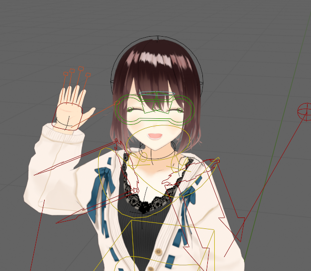
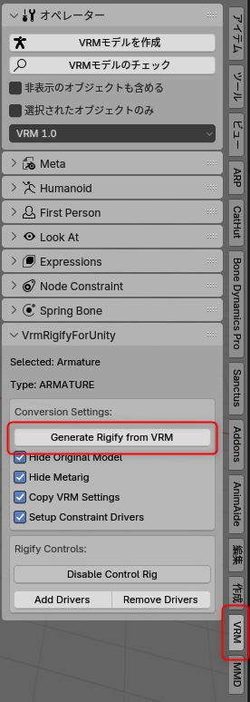
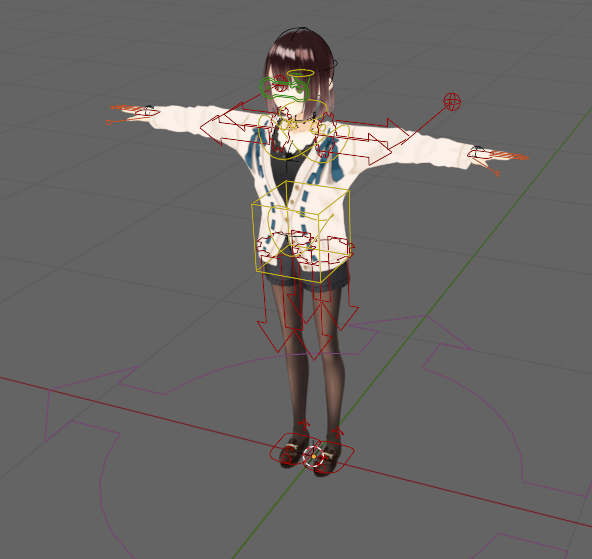
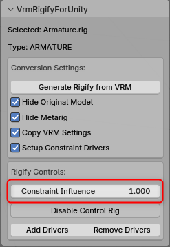

[日本語版 README はこちら / Japanese README here](README-ja.md)

# VrmRigifyForUnity

An addon to automatically generate Rigify rigs from VRM models in Blender and optimize them for Unity

## Overview

VrmRigifyForUnity is a Blender addon that imports 3D models in VRM format and automatically generates rigs using Blender's Rigify. The generated rigs are optimized for use in Unity while preserving VRM information.

This addon enables animation work on VRM models using Rigify's advanced rig controls while ensuring export compatibility with Unity.

## Features

- Automatic generation of Rigify rigs from VRM models
- Preservation of VRM facial expression control functionality
- Hierarchy structure and bone placement optimized for Unity
- Driver system for batch control of DEF bone constraints
- Transfer of original VRM extension information to the new rig
- Automatic connection of custom bones (hair, clothing, etc.)

## Requirements

- Blender 4.3.0 or later
- Blender's [Rigify addon](https://docs.blender.org/manual/en/latest/addons/rigging/rigify/index.html) (included with Blender)
- [VRM Add-on for Blender](https://github.com/saturday06/VRM-Addon-for-Blender)
- Primarily designed for VRM1. Detailed verification for VRM0 has not been completed.

## Installation

1. Download the zip file from Releases
2. Launch Blender and go to Edit → Preferences → Add-ons → Install
3. Select the downloaded ZIP file (without extracting) or select the `__init__.py` file in the folder
4. Enable the "VrmRigifyForUnity" addon
5. Verify that the Rigify addon is also enabled

## Usage

1. Import a VRM model into Blender
2. Select the imported VRM armature
3. Open the "VRM" tab in the 3D View sidebar
4. Adjust conversion settings as needed (such as hiding the original model)
5. Click the "Generate Rigify from VRM" button

6. Use the generated Rigify rig to create animations

7. Use the constraint influence slider to adjust the impact of the control rig

## Conversion Settings

- **Hide Original Model**: Hides the original VRM model after conversion
- **Hide Metarig**: Hides the metarig after conversion
- **Copy VRM Settings**: Copies VRM extension information to the new rig
- **Setup Constraint Drivers**: Sets up drivers for controlling DEF bone constraints

## Rigify Controls

- **Constraint Influence**: Adjusts the influence of constraints on DEF bones between 0-1
- **Disable Control Rig**: Completely disables constraints on DEF bones, making them directly editable
- **Add/Remove Drivers**: Adds or removes constraint drivers

## Notes

- This addon is under development, so unexpected behavior may occur
- It is recommended to create a backup of the original model before conversion
- Models with complex custom bones may require manual adjustment
- Models that do not strictly follow VRM specifications may experience unstable behavior

## Credits

This addon is developed based on R workshop's "Script to automatically generate and modify Rigify rigs from VRM."
- Original work: https://booth.pm/ja/items/5448887
- License: MIT License

## License

MIT License - See the [LICENSE](LICENSE) file for details.

---

## Developer Information

The main functions of the addon are divided into the following modules:

- `vrm_rigify.py`: Main conversion logic
- `vrm_extension_utils.py`: VRM extension information transfer
- `bone_constraint_utils.py`: Bone constraint operations
- `constraint_driver_utils.py`: Constraint driver management

Check these files for custom development or bug fixes.
*The structure may change in the future.